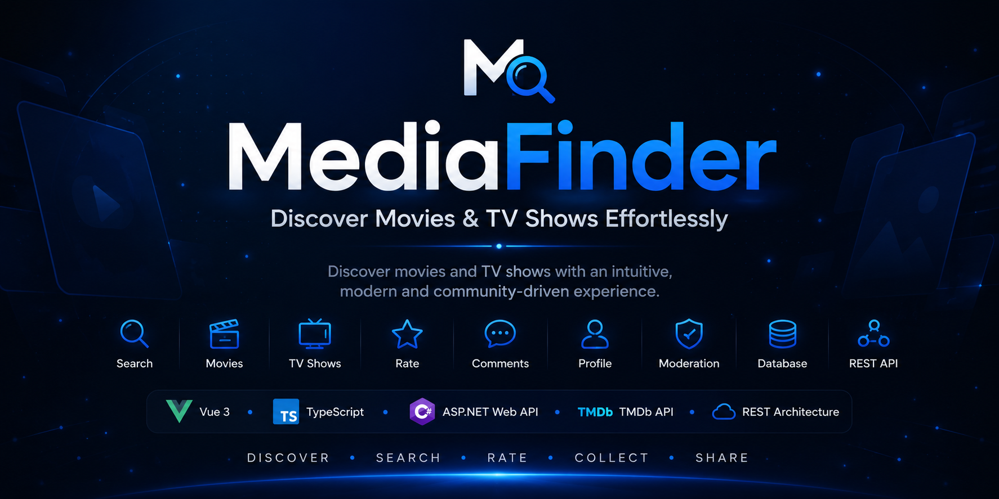
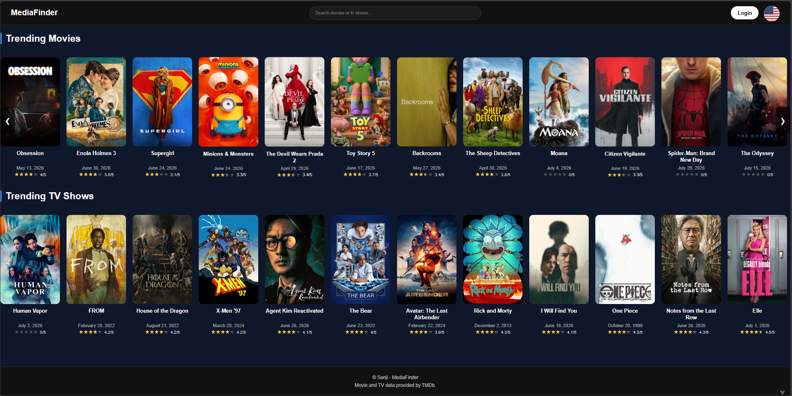
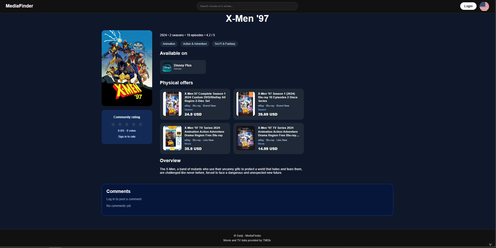
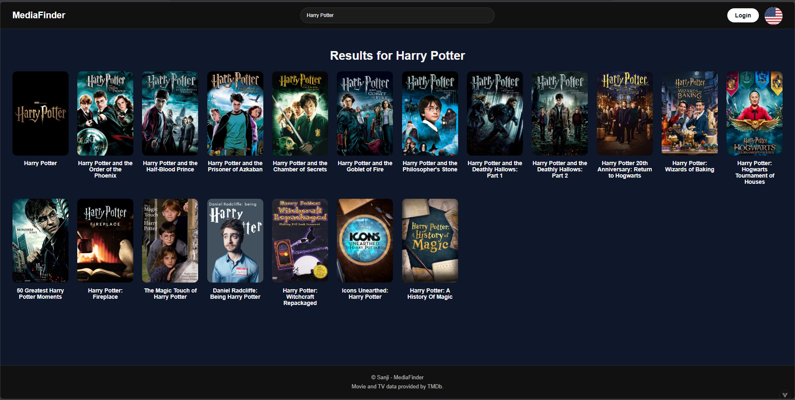
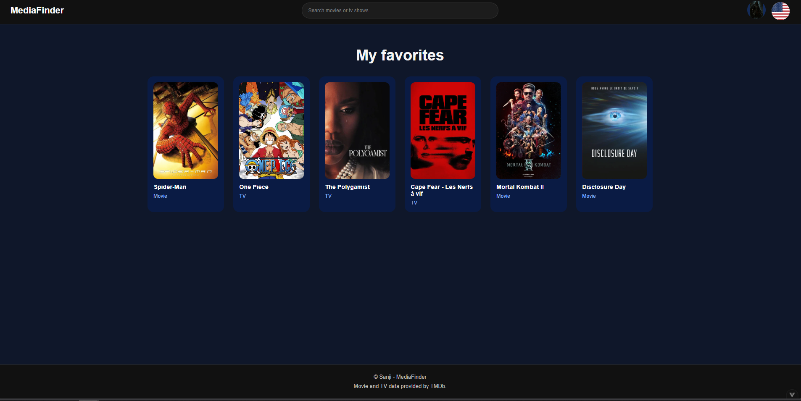
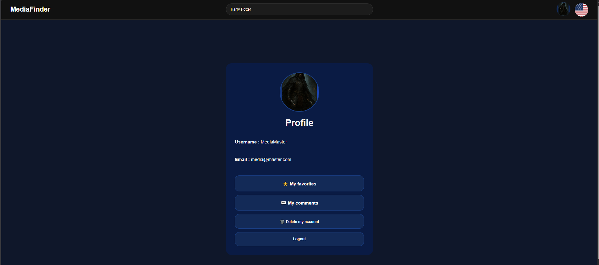
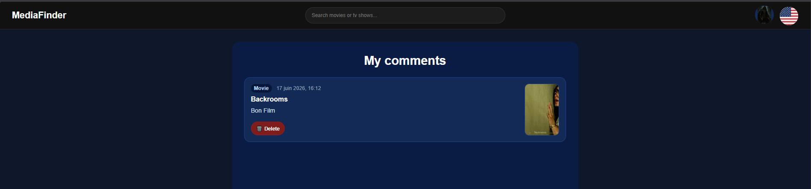
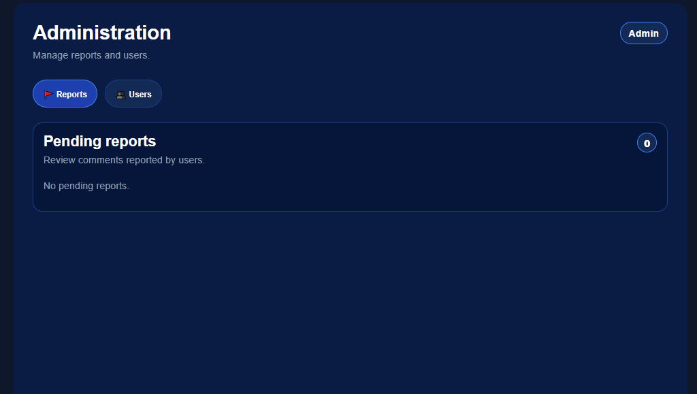
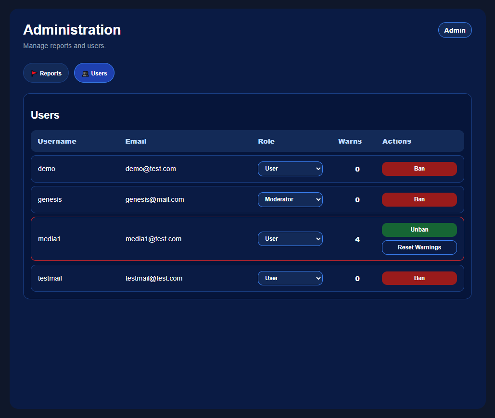

<p align="center">
  
</p>

<h1 align="center">MediaFinder Frontend</h1>

<p align="center">
  A modern and responsive media discovery platform built with Vue 3 and TypeScript.
  <br>
  Discover movies and TV shows, explore detailed information, manage favorites,
  interact with the community and enjoy a polished user experience.
</p>

<p align="center">


</p>

# 🚀 Application Preview

| Home | Media Details |
|------|---------------|
|  |  |

| Search | Favorites |
|--------|-----------|
|  |  |

| User Profile | My Comments |
|--------------|-------------|
|  |  |

| Administration - Reports | Administration - Users |
|--------------------------|------------------------|
|  |  |

# 🚀 What MediaFinder Offers

## 🎬 Media Discovery

- Browse trending **movies** and **TV shows**
- Discover detailed information about movies and series
- View release dates, genres, ratings and overviews
- Access official streaming providers
- Browse physical media offers (DVD, Blu-ray, 4K)
- Responsive media browsing experience

---

## 🔍  Smart Search

- Search for movies and TV shows
- Search for actors, directors and creators
- Explore content through intuitive search results
- Fast and responsive search experience

---

## 👤 Personalized Experience

- Secure user authentication
- Personalized profile page
- Favorite movies and TV shows
- Manage personal comments
- Community rating system
- Responsive interface
- Dark modern UI
- English / French localization

---

## 💬 Community

- Post comments on movies and TV shows
- Delete your own comments
- Community rating system
- Report inappropriate comments
- Safe and moderated discussions

---

## 🛡 Moderation & Administration

- Dedicated administration dashboard
- User management
- Moderator and Administrator roles
- Report management
- Warning system
- Automatic account suspension after multiple warnings
- Ban / Unban users
- Reset user warnings
- Role management

---

## 🏗 Modern Frontend

- Vue 3 Composition API
- TypeScript
- Vue Router
- Reusable components
- REST API integration
- Responsive layouts
- Modular architecture
- Service-based API layer
- Clean component organization

# 💡 Why MediaFinder?

MediaFinder was built as a portfolio project to demonstrate the development of a modern full-stack web application using current technologies and best practices.

Rather than focusing only on media discovery, the project showcases complete application workflows including authentication, community interactions, moderation tools, administration features and scalable frontend architecture.

The goal is to reproduce the structure and quality of a real-world production application while maintaining clean code, modular components and an intuitive user experience.

# 🛠 Built With

## Frontend

| Technology | Purpose |
|------------|---------|
| **Vue 3** | Modern reactive user interface |
| **TypeScript** | Strong typing and maintainability |
| **Vite** | Fast development and optimized builds |
| **Vue Router** | Client-side routing |
| **Vue I18n** | Internationalization (English & French) |
| **Axios** | Communication with the backend API |

## Development Tools

| Tool | Purpose |
|------|---------|
| **ESLint** | Code quality and consistency |
| **Prettier** | Code formatting |
| **npm** | Dependency management |

## Backend Integration

The frontend communicates with the **MediaFinder ASP.NET Web API**, which provides:

- Authentication
- Movies & TV Shows
- Search
- Favorites
- Comments
- Ratings
- Moderation
- Administration
- Physical media offers

# 🚀 Getting Started

## Prerequisites

Before running the project, make sure you have installed:

- Node.js 20+
- npm
- MediaFinder Backend API

## Installation

Clone the repository:

```bash
git clone https://github.com/yourusername/MediaFinderFront.git
```

Install dependencies:

```bash
npm install
```

Create a `.env.development` file:

```env
VITE_API_BASE_URL=https://localhost:5174
```

Start the development server:

```bash
npm run dev
```

Build for production:

```bash
npm run build
```

Run ESLint:

```bash
npm run lint
```

# 📂 Architecture

```text
src
├── assets
├── components
├── i18n
├── models
├── router
├── services
├── views
├── App.vue
└── main.ts
```

The application follows a modular architecture where reusable UI components, routing, localization and API services are clearly separated to improve maintainability and scalability.

# 🔮 What's Next?

- [ ] Global search improvements
- [ ] Advanced search filters
- [ ] Pagination
- [ ] User watchlists
- [ ] Personalized recommendations
- [ ] Progressive Web App (PWA)
- [ ] End-to-end testing
- [ ] Accessibility improvements

# 🙏 Acknowledgements

This project uses data provided by:

- **TMDb (The Movie Database)**
- **eBay Browse API**

Special thanks to the teams behind these services for providing high-quality APIs that make this project possible.

# 👨‍💻 Author

**Axel Aubry**

Full-Stack .NET & Vue Developer

- GitHub: https://github.com/Sanji69
- LinkedIn: https://linkedin.com/in/axel-aubry-549513158/

---

<p align="center">

Made with ❤️ using Vue 3, TypeScript and ASP.NET.

</p>